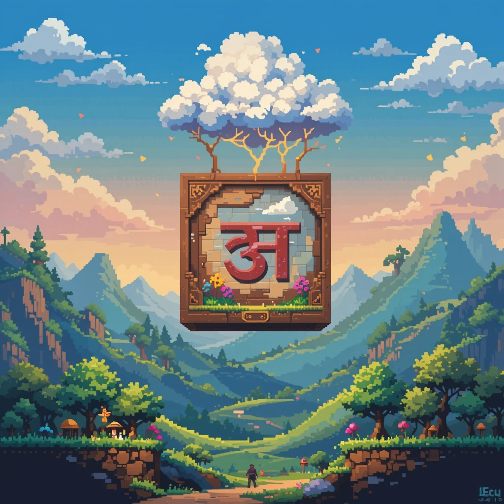

# 🎮 LexiDrop

<div align="center">
  
</div>

[](https://choosealicense.com/licenses/mit/)
[](https://lexidrop.vercel.app/)
[](https://lexidrop.vercel.app/)

A web-based tool for practicing and improving character recognition speed in Indian language scripts, inspired by DrLingua's kana bento game for learning the hiragana and katakana scripts.

## 🎯 Overview

LexiDrop is a simple drag n drop game with a timer built in intended to be used as a tool for improving recall speed
of character scripts for various Indian languages.


## 🌏 Supported Languages
Currently supported languages are:
* 🇮🇳 Hindi
* 🇧🇩 Bengali
* 🇮🇳 Kannada
* 🇮🇳 Malayalam
* 🇮🇳 Odia
* 🇮🇳 Punjabi
* 🇮🇳 Telugu

## 🚀 Getting started
### ▶️ Live Demo
The live version of the app can be found at [lexidrop.vercel.app](https://lexidrop.vercel.app/)

### 💻 Development

#### Prerequisites

- Node.js (Latest LTS version recommended)
- npm or yarn

#### Setup

1. Clone the repository:
```bash
git clone https://github.com/yourusername/lexidrop.git
cd lexidrop
```

2. Install dependencies:
```bash
npm install
# or
yarn
```

3. Start the development server:
```bash
npm run dev
# or
yarn dev
```

4. Open your browser and navigate to `http://localhost:5173`

## 🏗️ Building for Production

To create a production build:

```bash
npm run build
# or
yarn build
```

## 🔧 Extending for other languages
The game board can be generalised for all languages by adding a `language.js` file to the `src/constants` in the following format:
```js
const vowels = [
    { native: 'अ', english: 'a' },
    { native: 'आ', english: 'ā' },
    //...other vowels
];

const consonants = [
    { native: 'क', english: 'ka' },
    { native: 'ख', english: 'kha' },
    { native: 'ग', english: 'ga' },
    //..other vowels
];

const ALPHABET = {
    languageName: 'Language Name',
    vowels: vowels,
    consonants: consonants,
    omniglotLink: 'https://www.omniglot.com/writing/hindi.htm', //optional
};

export default ALPHABET;
```
After adding the file, the language will appear in the `/game_board` route for selection.

## ⚠️ Limitations
Since I'm not a frontend developer, I got claude to add styles and write the basic game logic, then modified it a bit to be readable.
Following are the known limitations:
* Doesn't yet support vowel diacritics (matras) or conjunct consonants, but should be easy enough to add.
* Requires the languages constants to have unique character transliteration mappings in English. If 2 native characters are mapped to the same english translieteration, you may notice glitches.

## 🛠️ Tech Stack


- React 19
- React DND (Drag and Drop)
- TailwindCSS
- Vite
- Vercel for hosting

## 👥 Contributing

Contributions are welcome! Please feel free to submit a Pull Request or open Issues if you find any.

1. Fork the repository
2. Create your feature branch (`git checkout -b feature/AmazingFeature`)
3. Commit your changes (`git commit -m 'Add some AmazingFeature'`)
4. Push to the branch (`git push origin feature/AmazingFeature`)
5. Open a Pull Request

## 🙏 Acknowledgments

- Inspired by [DrLingua](https://drlingua.com/)'s approach to learning Hiragana and Katakana.
- Built to fill the gap in Indian languages' script learning resources

## 📝 License

This project is licensed under the MIT License - see the [LICENSE](LICENSE) file for details.
